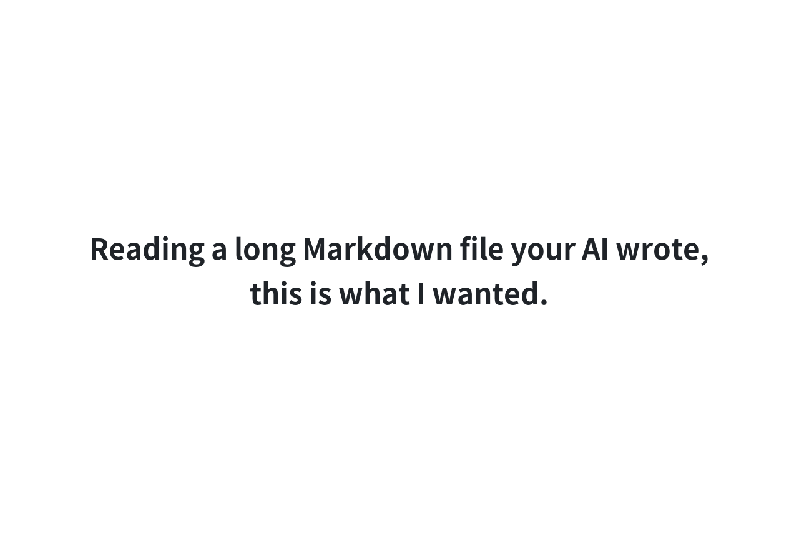
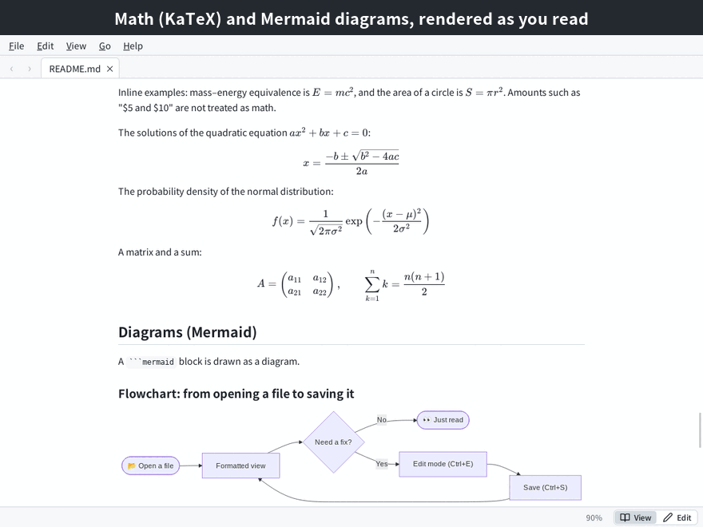
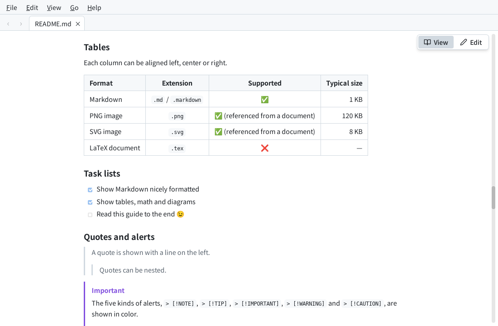
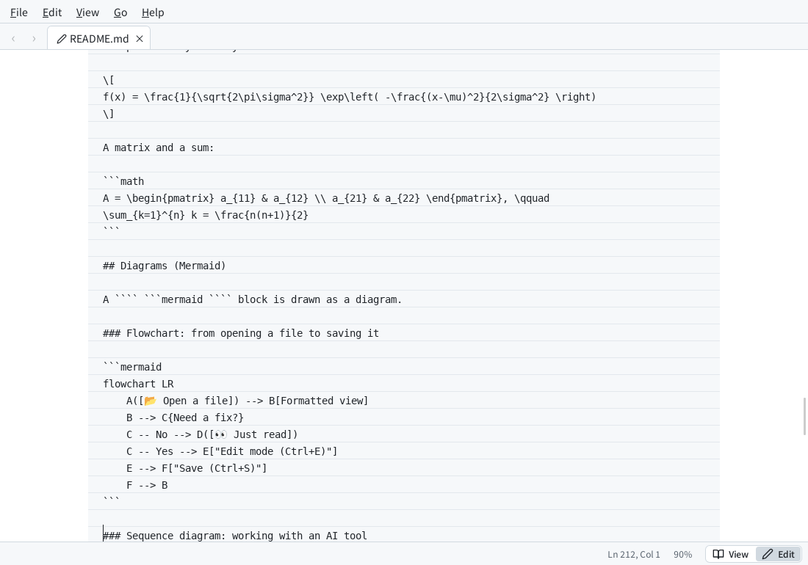
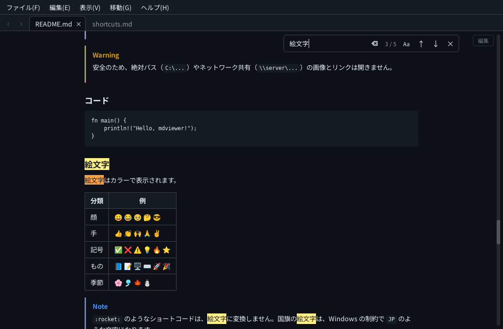
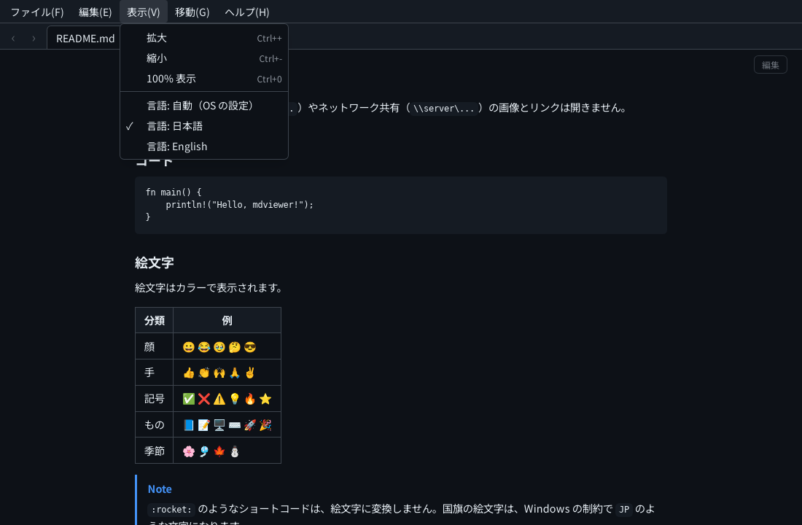

<h1 align="center">mdviewer</h1>

<p align="center"><strong>English</strong> | <a href="README.ja.md">日本語</a></p>

<h2 align="center">AI writes the Markdown.<br>mdviewer makes it a pleasure to read.</h2>

<p align="center">
Double-click a <code>.md</code> file.<br>
Read tables, Mermaid diagrams and math beautifully.<br>
Edit only when you need to.
</p>

<p align="center"></p>

<p align="center">
<a href="https://github.com/muraken720/mdviewer/releases/latest"></a><br>
Free and open source · Windows 10 / 11 · Installer or portable zip (<a href="#install">details</a>)
</p>

<p align="center">
<a href="https://github.com/muraken720/mdviewer/actions/workflows/ci.yml"></a>
<a href="LICENSE"></a>
</p>

## Why mdviewer

A small, fast Markdown viewer and editor for Windows.
Your AI writes and rewrites the Markdown; mdviewer shows it as a nicely formatted page, without converting it to HTML first, and lets you make small fixes on the spot.

- **Small**: a single exe of about 11 MB. It uses the WebView2 that comes with Windows, so no browser engine is bundled (Rust + Tauri 2)
- **Fast**: Markdown is converted in Rust ([pulldown-cmark](https://github.com/pulldown-cmark/pulldown-cmark))
- **Nothing extra**: only what you use every time you read a file or make a quick fix. Want to edit a table or a Mermaid diagram with ease, or translate a document into your language? Your LLM does all of that well, so mdviewer deliberately adds no such editing features

See the [user guide](docs/manual/README.md) for how to use it. The guide doubles as a sample of what mdviewer can display: tables, diagrams, math, emoji and more (the animation under Screenshots shows the guide itself).

## Screenshots



| Tables, task lists and alerts | Edit mode (edit the Markdown directly) |
|:---:|:---:|
|  |  |
| **Dark theme and find (emoji in color)** | **View menu (theme and language)** |
|  |  |

The screenshots were taken with the Linux build used for development. On Windows, the window frame and the emoji artwork (Segoe UI Emoji) look different.

## Features

| Feature | How |
|---|---|
| Formatted Markdown | Double-click a `.md` file / drop it on the window / <kbd>Ctrl</kbd>+<kbd>O</kbd> |
| Tabs | Other files open in new tabs (double-clicking another `.md` while mdviewer is running opens it as a tab in the same window). <kbd>Ctrl</kbd>+<kbd>Tab</kbd> / <kbd>Ctrl</kbd>+<kbd>Shift</kbd>+<kbd>Tab</kbd> to switch, <kbd>Ctrl</kbd>+<kbd>W</kbd> to close |
| Back and forward | Links in a document open in the same tab. Go back and forward with <kbd>Alt</kbd>+<kbd>←</kbd> / <kbd>Alt</kbd>+<kbd>→</kbd>, the buttons at the left of the tab bar, the mouse back / forward buttons, or the **Go** menu (the scroll position comes back too) |
| Find | <kbd>Ctrl</kbd>+<kbd>F</kbd>. Highlights matches and shows the count. <kbd>Enter</kbd> / <kbd>Shift</kbd>+<kbd>Enter</kbd> (or <kbd>F3</kbd> / <kbd>Shift</kbd>+<kbd>F3</kbd>) for the next / previous match |
| Menus | File, Edit, View, Go and Help. <kbd>Alt</kbd> or <kbd>F10</kbd> moves to the menu bar, <kbd>Alt</kbd>+<kbd>F</kbd> etc. opens a menu directly |
| Language | Menus in English and Japanese, chosen from your system language and switchable in the **View** menu (remembered) |
| Help | <kbd>F1</kbd> shows the keyboard shortcuts. **Help → About mdviewer** shows the version, author and license |
| Edit mode | <kbd>Ctrl</kbd>+<kbd>E</kbd> or the View \| Edit switch at the bottom right, in the status bar (switch back to see your edits formatted; both keep roughly the same place in the document). The text column turns into a light gray sheet with faint ruled lines, the status bar shows the cursor line and column, and tabs being edited are marked with a pencil |
| Save | <kbd>Ctrl</kbd>+<kbd>S</kbd> (keeps the file's line endings, CRLF / LF, and BOM). The title shows `●` while there are unsaved changes |
| Zoom | <kbd>Ctrl</kbd>+wheel / <kbd>Ctrl</kbd>+<kbd>+</kbd> <kbd>-</kbd> (<kbd>Ctrl</kbd>+<kbd>0</kbd> for 100%). The level is shown in the status bar (click it for 100%) and remembered |
| Auto reload | Updates the view when the file changes (keeping the scroll position). <kbd>F5</kbd> reloads manually. Unsaved edits are never overwritten |
| Table of contents | In a wide window (1280 px or more), the document title and headings are listed at the right (the title goes back to the top). The section you are reading is highlighted; click a heading to jump to it. Turn it off in the **View** menu (remembered) |
| Links | `#heading` jumps within the document, `other.md` opens in mdviewer, `https://` opens in your default browser |
| Theme (dark mode) | Switch between Light and Dark in the **View** menu (remembered). On the first launch mdviewer picks the one that matches your Windows setting. Diagram (Mermaid) colors follow the theme |
| Japanese font | Noto Sans JP is bundled, so Japanese text looks the same even if the font is not installed |
| Emoji | Shows ✅ ⚠️ 🚀 and others in color (Segoe UI Emoji on Windows). Flag emoji show as letters (such as `JP`) because of a Windows limitation. Shortcodes such as `:rocket:` are not converted |

Supported syntax: CommonMark + GFM (tables, task lists, strikethrough, footnotes, `> [!NOTE]` alerts), images, math and diagrams.

Images are shown for paths relative to the document (such as ``) and for https URLs. For safety, images and links with absolute paths (`C:\...`) or on network shares (`\\server\...`) are not opened ([SECURITY.md](SECURITY.md)).

### Math (TeX / LaTeX)

Typeset with [KaTeX](https://katex.org/). These forms are supported:

| Syntax | Kind |
|---|---|
| `$E = mc^2$`, `\(E = mc^2\)` | Inline math |
| `$$ … $$`, `\[ … \]`, ```` ```math ```` blocks | Display math |

- `\(…\)` and `\[…\]` are the LaTeX forms that AI tools such as ChatGPT often write
- Amounts such as `$5 and $10` are not treated as math (as in Pandoc, a closing `$` right after a space or right before a digit does not close math). Write `\$` to always show a dollar sign
- `\[…\]` whose content does not look like math, such as `\[1\]`, is shown as a Markdown escape (the brackets themselves)
- Nothing inside code (`` ` `` or ```` ``` ````) is converted
- Typesetting `.tex` files (whole LaTeX documents) is not supported

### Diagrams (Mermaid)

```` ```mermaid ```` blocks are drawn as diagrams ([Mermaid](https://mermaid.js.org/) 11).

### Editor

| Key | Action |
|---|---|
| <kbd>Enter</kbd> | Keeps the indentation. Continues bullet lists, numbered lists (the number goes up by one), task lists and quotes. On an empty item it ends the list (or goes up one level when nested) |
| <kbd>Tab</kbd> / <kbd>Shift</kbd>+<kbd>Tab</kbd> | Indent / outdent list items or the selected lines |
| <kbd>Ctrl</kbd>+<kbd>B</kbd> / <kbd>Ctrl</kbd>+<kbd>I</kbd> | Toggle bold / italic |
| <kbd>Ctrl</kbd>+<kbd>Z</kbd> / <kbd>Ctrl</kbd>+<kbd>Y</kbd> | Undo / redo (including the automatic edits above) |

Inside code blocks (```` ``` ````) lists are not continued; only the indentation is kept. The <kbd>Enter</kbd> that confirms IME input (for example, Japanese) is ignored.
mdviewer asks before closing, opening another file or reloading with <kbd>F5</kbd> when there are unsaved changes.

## Settings

Each plugin can be turned on or off in a settings file. Without the file, everything uses the defaults.

- Windows: `%APPDATA%\io.github.muraken720.mdviewer\settings.json`
- Linux: `~/.config/io.github.muraken720.mdviewer/settings.json`

```json
{
  "plugins": {
    "mermaid": false,
    "auto-reload": false
  }
}
```

| Plugin | Default | What it does |
|---|---|---|
| `math` | On | Math. KaTeX is loaded only when a document contains math |
| `mermaid` | On | Draws ```` ```mermaid ```` blocks as diagrams. The library is loaded only when a document contains a diagram |
| `gfm`, `heading-anchors`, `local-images` | On | Markdown extensions, heading anchors, images with relative paths |
| `menu`, `tabs`, `view`, `editor`, `find`, `theme`, `language`, `help`, `zoom`, `toc`, `links`, `auto-reload`, `title`, `open-file` | On | UI features |

Changes take effect the next time mdviewer starts.

### Out of scope

Syntax highlighting, live preview (side by side), a file tree, session restore, export, table or diagram editors, translation and so on. Heavy editing is what your LLM is for.
The reasons and the criteria are in [CONTRIBUTING.md](CONTRIBUTING.md#スコープ方針) (Japanese).

## Install

Get one of these from [Releases](https://github.com/muraken720/mdviewer/releases):

- `mdviewer_x.y.z_x64-setup.exe`: the installer. It associates `.md` / `.markdown` files with mdviewer
- `mdviewer_x.y.z_x64-setup.zip`: the same installer in a zip, for when your browser or network warns about or blocks downloading an `.exe`. Extract it and run `mdviewer_x.y.z_x64-setup.exe`
- `mdviewer_x.y.z_x64_portable.zip`: the portable version. Put the extracted `mdviewer.exe` anywhere (associate files yourself with **Open with**)

Each includes the license (`LICENSE.txt`) and the full license texts of the open source software used (`THIRD_PARTY_LICENSES.md`).

Requirements: Windows 10 / 11 (WebView2 Runtime, included in Windows 11)

> [!NOTE]
> The executables are not code-signed yet (see [Code signing policy](#code-signing-policy)), so SmartScreen may show "Windows protected your PC" on the first launch, and the publisher is shown as unknown.
> Click **More info → Run anyway** to start it. If in doubt, check that the file came from [Releases](https://github.com/muraken720/mdviewer/releases).

You can also open a file from the command line:

```
mdviewer.exe path\to\file.md
```

### Code signing policy

We are applying for free code signing for the Windows releases: code signing provided by [SignPath.io](https://about.signpath.io/), certificate by [SignPath Foundation](https://signpath.org/). Releases up to and including v0.2.1 are not signed.

- Committers and reviewers: [Kenichiro Murata](https://github.com/muraken720)
- Approvers: [Kenichiro Murata](https://github.com/muraken720)

Release files are built only by GitHub Actions from this repository ([release.yml](.github/workflows/release.yml)), and each signing request is approved by hand.

### Privacy

mdviewer does not send any information to other networked systems unless you ask it to. It has no telemetry and no automatic update check. The only network access is for `https://` images in the document you open, and a clicked `https://` link opens in your default browser.

## Development

Requirements: Rust (stable), Node.js 22 or later

The UI is TypeScript + React + Tailwind CSS (built with Vite); Markdown is converted in Rust.

```sh
npm ci                           # install dependencies
npm run tauri dev                # run in development (UI hot reload)
npm test                         # UI tests (Vitest)
npm run lint                     # lint + format check (Biome)
npm run typecheck                # type check
cargo test --workspace           # Rust tests (run npm run build first)
npm run tauri build              # release build + installer (on Windows)
```

To develop on Linux you need Tauri's [prerequisites](https://tauri.app/start/prerequisites/) (such as `libwebkit2gtk-4.1-dev`).

- User guide (doubles as a rendering sample): [docs/manual/README.md](docs/manual/README.md) ([Japanese](docs/manual/ja/README.md))
- Architecture: [docs/ARCHITECTURE.md](docs/ARCHITECTURE.md)
- Writing plugins: [docs/PLUGINS.md](docs/PLUGINS.md)
- Contributing: [CONTRIBUTING.md](CONTRIBUTING.md)
- Security: [SECURITY.md](SECURITY.md)

The developer documents are in Japanese. Issues and pull requests in English are welcome.

## License

[MIT](LICENSE)

mdviewer stands on the shoulders of many open source projects. Thank you to their authors and contributors.
The main projects are introduced in [docs/ACKNOWLEDGEMENTS.md](docs/ACKNOWLEDGEMENTS.md), and the full license texts of all software included in the release are in [THIRD_PARTY_LICENSES.md](THIRD_PARTY_LICENSES.md).

Main bundled software:

| Software | License |
|---|---|
| [React](https://react.dev/) | MIT |
| [KaTeX](https://katex.org/) (including its fonts) | MIT |
| [DOMPurify](https://github.com/cure53/DOMPurify) | Apache-2.0 or MPL-2.0 |
| [Mermaid](https://mermaid.js.org/) | MIT |
| [Noto Sans JP](https://fonts.google.com/noto/specimen/Noto+Sans+JP) ([Fontsource](https://fontsource.org/)) | SIL Open Font License 1.1 |
