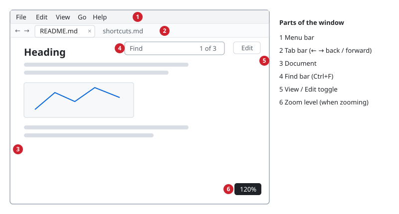
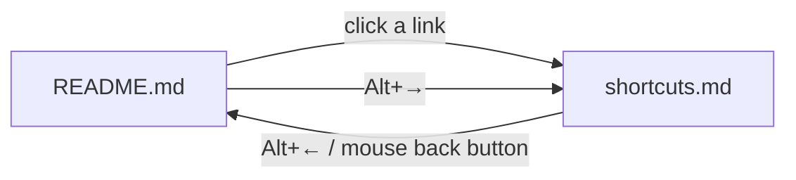
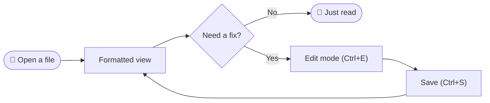
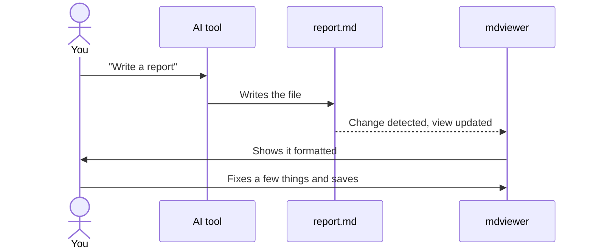
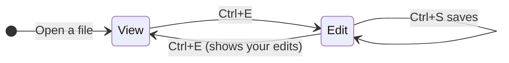

# 📘 mdviewer User Guide

mdviewer is a small Windows tool for **reading Markdown (`.md`) comfortably and fixing it on the spot**. This guide also doubles as a sample of what mdviewer can display (tables, diagrams, math, emoji and more). Open it in mdviewer to see how it renders.

[日本語版はこちら](../README.md)

> [!TIP]
> If you are viewing this file in mdviewer, open the [keyboard shortcuts](shortcuts.md) and then press <kbd>Alt</kbd>+<kbd>←</kbd> to come back here.

## Contents

1. [The window](#the-window)
2. [Opening files](#opening-files)
3. [Tabs, back and forward](#tabs-back-and-forward)
4. [Editing and saving](#editing-and-saving)
5. [Find, zoom, theme and language](#find-zoom-theme-and-language)
6. [Supported syntax](#supported-syntax)
7. [Math](#math)
8. [Diagrams (Mermaid)](#diagrams-mermaid)
9. [Troubleshooting](#troubleshooting)

---

## The window



| No. | Part | What it does |
|:---:|---|---|
| 1 | Menu bar | Every command is in the menus. Press <kbd>Alt</kbd> or <kbd>F10</kbd> to use it from the keyboard |
| 2 | Tab bar | The open files. The ← → buttons at the left go back and forward |
| 3 | Document | The formatted Markdown. <kbd>Ctrl</kbd>+wheel zooms in and out |
| 4 | Find bar | Shown with <kbd>Ctrl</kbd>+<kbd>F</kbd>. Matches are highlighted |
| 5 | View / Edit toggle | Switches between the formatted view and the Markdown text |
| 6 | Zoom level | Shown briefly when you zoom |

## Opening files

Any of these works:

- 📂 Double-click a `.md` file (when associated by the installer)
- 🖱️ Drag and drop files onto the window (several at once is fine)
- ⌨️ <kbd>Ctrl</kbd>+<kbd>O</kbd>, or **File → Open…**
- 💻 From the command line: `mdviewer.exe path\to\file.md`

When the file is changed by another program, the view **updates automatically** (keeping the scroll position).
This makes mdviewer a good companion for a `.md` file that an AI tool or an editor is writing.

## Tabs, back and forward

Another file opens in a new tab. If the file is already open, mdviewer switches to its tab.
Double-clicking another `.md` in Explorer while mdviewer is running also opens it as a tab in the same window.

Links in a document, such as `other.md`, open **in the same tab**. As in a web browser, you can go back to the previous document.



| Action | Keyboard | Mouse |
|---|---|---|
| Back | <kbd>Alt</kbd>+<kbd>←</kbd> | Back button, ← in the tab bar |
| Forward | <kbd>Alt</kbd>+<kbd>→</kbd> | Forward button, → in the tab bar |
| Next / previous tab | <kbd>Ctrl</kbd>+<kbd>Tab</kbd> / <kbd>Ctrl</kbd>+<kbd>Shift</kbd>+<kbd>Tab</kbd> | Click the tab |
| Close tab | <kbd>Ctrl</kbd>+<kbd>W</kbd> | × button, middle-click the tab |

Going back also restores the scroll position.

## Editing and saving

<kbd>Ctrl</kbd>+<kbd>E</kbd> (or the **Edit** button at the top right) switches to edit mode.
Press it again to see your edits formatted. <kbd>Ctrl</kbd>+<kbd>S</kbd> saves.

When you write a list, <kbd>Enter</kbd> continues it for you:

```markdown
- [ ] Groceries     ← press Enter here
- [ ]               ← the next item appears (Enter on an empty item ends the list)

1. First step
2.                  ← numbers go up by one
```

| Key | Action |
|---|---|
| <kbd>Enter</kbd> | New line, keeping the indentation. Continues lists and quotes |
| <kbd>Tab</kbd> / <kbd>Shift</kbd>+<kbd>Tab</kbd> | Indent / outdent list items |
| <kbd>Ctrl</kbd>+<kbd>B</kbd> / <kbd>Ctrl</kbd>+<kbd>I</kbd> | **Bold** / *italic* |
| <kbd>Ctrl</kbd>+<kbd>Z</kbd> / <kbd>Ctrl</kbd>+<kbd>Y</kbd> | Undo / redo |

> [!NOTE]
> Saving keeps the file's original line endings (CRLF / LF) and BOM.
> While there are unsaved changes, the title shows `●`, and mdviewer asks before closing.

## Find, zoom, theme and language

- 🔍 **Find**: <kbd>Ctrl</kbd>+<kbd>F</kbd>. <kbd>Enter</kbd> / <kbd>Shift</kbd>+<kbd>Enter</kbd> (or <kbd>F3</kbd> / <kbd>Shift</kbd>+<kbd>F3</kbd>) for the next / previous match. <kbd>Esc</kbd> closes
- 🔎 **Zoom**: <kbd>Ctrl</kbd>+wheel, <kbd>Ctrl</kbd>+<kbd>+</kbd> / <kbd>Ctrl</kbd>+<kbd>-</kbd>, and <kbd>Ctrl</kbd>+<kbd>0</kbd> for 100%. The zoom level is remembered
- 🌐 **Language**: the menus are in Japanese and English, chosen from your system language. Change it in **View → Language**
- ❓ **Help**: <kbd>F1</kbd> shows the keyboard shortcuts. **Help → About mdviewer** shows the version
- 🌙 **Theme (dark mode)**: switch between Light and Dark in the **View** menu. On the first launch mdviewer picks the one that matches your Windows setting. Your choice is remembered

## Supported syntax

CommonMark and GitHub Flavored Markdown (GFM).

### Text styles

**Bold**, *italic*, ~~strikethrough~~, `inline code`, [links](https://github.com/muraken720/mdviewer) and footnotes[^1].

### Tables

Each column can be aligned left, center or right.

| Format | Extension | Supported | Typical size |
|:---|:---:|:---:|---:|
| Markdown | `.md` / `.markdown` | ✅ | 1 KB |
| PNG image | `.png` | ✅ (referenced from a document) | 120 KB |
| SVG image | `.svg` | ✅ (referenced from a document) | 8 KB |
| LaTeX document | `.tex` | ❌ | — |

### Task lists

- [x] Show Markdown nicely formatted
- [x] Show tables, math and diagrams
- [ ] Read this guide to the end 😉

### Quotes and alerts

> A quote is shown with a line on the left.
>
> > Quotes can be nested.

> [!IMPORTANT]
> The five kinds of alerts, `> [!NOTE]`, `> [!TIP]`, `> [!IMPORTANT]`, `> [!WARNING]` and `> [!CAUTION]`, are shown in color.

> [!WARNING]
> For safety, images and links with absolute paths (`C:\...`) or network shares (`\\server\...`) are not opened.

### Code

```rust
fn main() {
    println!("Hello, mdviewer!");
}
```

### Emoji

Emoji are shown in color.

| Group | Examples |
|---|---|
| Faces | 😀 😂 🥹 🤔 😎 |
| Hands | 👍 👏 🙌 🙏 ✌️ |
| Symbols | ✅ ❌ ⚠️ 💡 🔥 ⭐ |
| Objects | 📘 📝 🖥️ ⌨️ 🚀 🎉 |
| Seasons | 🌸 🎐 🍁 ⛄ |

> [!NOTE]
> Shortcodes such as `:rocket:` are not converted to emoji. Flag emoji show as letters (such as `JP`) because of a Windows limitation.

## Math

Math is typeset with [KaTeX](https://katex.org/). Write inline math as `$...$` or `\(...\)`, and display math as `$$...$$` or `\[...\]`.

> [!NOTE]
> In the examples below, math written with `\(...\)` and `\[...\]`, and the dollar amounts, look different on GitHub than in mdviewer (GitHub does not support these forms).

Inline examples: mass–energy equivalence is $E = mc^2$, and the area of a circle is \(S = \pi r^2\). Amounts such as "$5 and $10" are not treated as math.

The solutions of the quadratic equation $ax^2 + bx + c = 0$:

$$
x = \frac{-b \pm \sqrt{b^2 - 4ac}}{2a}
$$

The probability density of the normal distribution:

\[
f(x) = \frac{1}{\sqrt{2\pi\sigma^2}} \exp\left( -\frac{(x-\mu)^2}{2\sigma^2} \right)
\]

A matrix and a sum:

```math
A = \begin{pmatrix} a_{11} & a_{12} \\ a_{21} & a_{22} \end{pmatrix}, \qquad
\sum_{k=1}^{n} k = \frac{n(n+1)}{2}
```

## Diagrams (Mermaid)

A ```` ```mermaid ```` block is drawn as a diagram.

### Flowchart: from opening a file to saving it



### Sequence diagram: working with an AI tool



### State diagram: view and edit



## Troubleshooting

<details>
<summary>"Windows protected your PC" appears</summary>

The executable is not code-signed, so SmartScreen may show this screen on the first launch.
Click **More info → Run anyway** to start mdviewer.

</details>

<details>
<summary>Diagrams or math are not shown</summary>

Check that `mermaid` or `math` is not turned off in the settings file (`%APPDATA%\io.github.muraken720.mdviewer\settings.json`).

</details>

<details>
<summary>Images are not shown</summary>

mdviewer shows images with a path relative to the document (such as `images/a.png`) and `https://` images. Images with absolute paths or on network shares are not shown, for safety.

</details>

---

😊 Bug reports and ideas are welcome in [GitHub Issues](https://github.com/muraken720/mdviewer/issues).

[^1]: This is the footnote text. It is shown where it is defined (at the end of this document).
