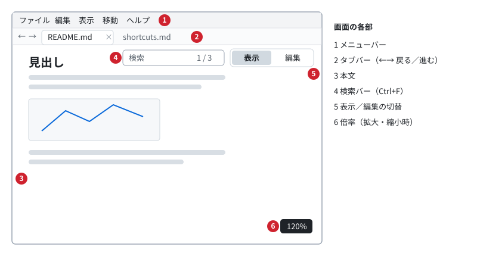
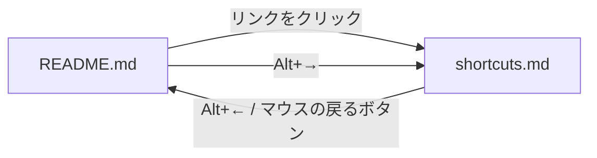
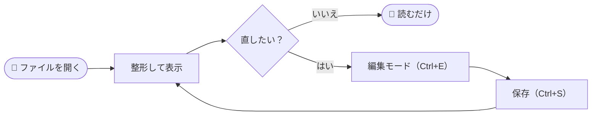
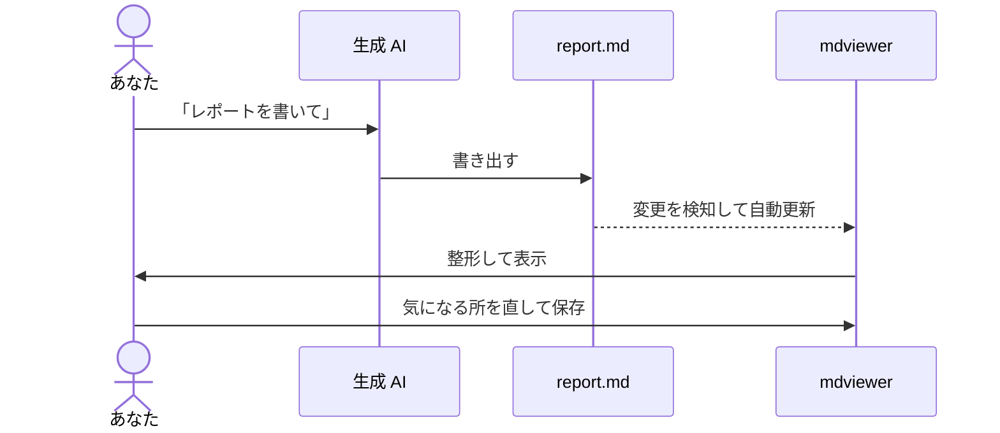
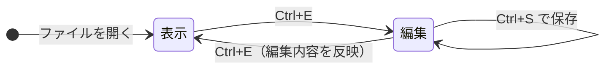

# 📘 mdviewer 操作マニュアル

mdviewer は、Markdown（`.md`）を **読みやすく表示し、その場で直す** ための Windows 向けの小さなツールです。このマニュアル自体も、mdviewer で表示できる記法（表・図・数式・絵文字など）の見本を兼ねています。mdviewer で開いて、表示を確かめてください。

[English version](../README.md)

> [!TIP]
> このファイルを mdviewer で開いている場合は、[ショートカット一覧](shortcuts.md) を開いてから <kbd>Alt</kbd>+<kbd>←</kbd> を押すと、ここに戻れます。

## 目次

1. [画面の見かた](#画面の見かた)
2. [ファイルを開く](#ファイルを開く)
3. [タブと、戻る／進む](#タブと戻る進む)
4. [編集と保存](#編集と保存)
5. [検索・拡大・テーマ・言語](#検索拡大テーマ言語)
6. [表示できる記法](#表示できる記法)
7. [数式](#数式)
8. [図（Mermaid）](#図mermaid)
9. [困ったときは](#困ったときは)

---

## 画面の見かた



| 番号 | 名前 | できること |
|:---:|---|---|
| 1 | メニューバー | すべての操作をメニューから選べます。<kbd>Alt</kbd> または <kbd>F10</kbd> でキーボード操作 |
| 2 | タブバー | 開いているファイルの一覧。左端の ← → は、戻る／進む |
| 3 | 本文 | Markdown を整形して表示します。<kbd>Ctrl</kbd>+ホイールで拡大・縮小 |
| 4 | 検索バー | <kbd>Ctrl</kbd>+<kbd>F</kbd> で表示。一致した箇所をハイライト |
| 5 | 表示／編集の切替 | 押すたびに、表示と編集（Markdown のテキスト）を切り替えます |
| 6 | 倍率 | 拡大・縮小したときに、少しの間だけ表示されます |

## ファイルを開く

次のどの方法でも開けます。

- 📂 `.md` ファイルをダブルクリックする（インストーラで関連付けた場合）
- 🖱️ ファイルをウィンドウにドラッグ＆ドロップする（複数可）
- ⌨️ <kbd>Ctrl</kbd>+<kbd>O</kbd>、または「ファイル → ファイルを開く…」
- 💻 コマンドラインから `mdviewer.exe path\to\file.md`

ファイルが外部で書き換えられると、表示が**自動で更新**されます（スクロール位置はそのまま）。
生成 AI やエディタが書き出している `.md` を、横で開きっぱなしにしておく使い方に向いています。

## タブと、戻る／進む

別のファイルを開くと、新しいタブに開きます。すでに開いているファイルなら、そのタブに切り替わります。
mdviewer の起動中に、エクスプローラーで別の `.md` をダブルクリックしても、同じウィンドウのタブに開きます。

文書の中の `other.md` のようなリンクは、**同じタブ**に開きます。ブラウザと同じように、前の文書に戻れます。



| 操作 | キー | マウス |
|---|---|---|
| 戻る | <kbd>Alt</kbd>+<kbd>←</kbd> | 戻るボタン、タブバーの ← |
| 進む | <kbd>Alt</kbd>+<kbd>→</kbd> | 進むボタン、タブバーの → |
| 次／前のタブ | <kbd>Ctrl</kbd>+<kbd>Tab</kbd> / <kbd>Ctrl</kbd>+<kbd>Shift</kbd>+<kbd>Tab</kbd> | タブをクリック |
| タブを閉じる | <kbd>Ctrl</kbd>+<kbd>W</kbd> | × ボタン、タブの中クリック |

戻ったときは、スクロール位置も元に戻ります。

## 編集と保存

<kbd>Ctrl</kbd>+<kbd>E</kbd>（または右上の「編集」ボタン）で編集モードになります。
もう一度押すと、編集した内容で表示し直します。<kbd>Ctrl</kbd>+<kbd>S</kbd> で保存します。

リストを書くときは、<kbd>Enter</kbd> で次の項目が自動で続きます。

```markdown
- [ ] 買い物        ← ここで Enter を押すと
- [ ]               ← 次の行が自動でできる（何も書かずに Enter でリストを抜ける）

1. 手順その1
2.                  ← 番号も自動で +1
```

| キー | 動作 |
|---|---|
| <kbd>Enter</kbd> | インデントを保ったまま改行。リスト・引用を継続 |
| <kbd>Tab</kbd> / <kbd>Shift</kbd>+<kbd>Tab</kbd> | リストの字下げ／字上げ |
| <kbd>Ctrl</kbd>+<kbd>B</kbd> / <kbd>Ctrl</kbd>+<kbd>I</kbd> | **太字** / *斜体* |
| <kbd>Ctrl</kbd>+<kbd>Z</kbd> / <kbd>Ctrl</kbd>+<kbd>Y</kbd> | 元に戻す／やり直し |

> [!NOTE]
> 保存しても、元のファイルの改行コード（CRLF / LF）と BOM はそのまま保たれます。
> 保存していない変更があるときは、タイトルに `●` が付きます。閉じるときには確認が出ます。

## 検索・拡大・テーマ・言語

- 🔍 **検索**：<kbd>Ctrl</kbd>+<kbd>F</kbd>。<kbd>Enter</kbd> / <kbd>Shift</kbd>+<kbd>Enter</kbd>（または <kbd>F3</kbd> / <kbd>Shift</kbd>+<kbd>F3</kbd>）で次／前へ。<kbd>Esc</kbd> で閉じる
- 🔎 **拡大・縮小**：<kbd>Ctrl</kbd>+ホイール、<kbd>Ctrl</kbd>+<kbd>+</kbd> / <kbd>Ctrl</kbd>+<kbd>-</kbd>、<kbd>Ctrl</kbd>+<kbd>0</kbd> で 100%。倍率は次回も保たれます
- 🌐 **言語**：メニューは日本語と英語。OS の設定に合わせて自動で選びます。「表示 → 言語」で切り替えられます
- ❓ **ヘルプ**：<kbd>F1</kbd> でショートカット一覧。「ヘルプ → mdviewer について」でバージョンを確認できます
- 🌙 **テーマ（ダークモード）**：「表示」メニューで、ライトとダークを切り替えられます。初めて起動したときは、Windows の設定（ライト／ダーク）に合わせて自動で選びます。選んだテーマは次回も保たれます

## 表示できる記法

CommonMark と GitHub Flavored Markdown（GFM）に対応しています。

### 文字の装飾

**太字**、*斜体*、~~取り消し線~~、`インラインコード`、[リンク](https://github.com/muraken720/mdviewer)、脚注[^1]。

### 表

列ごとに、左寄せ・中央寄せ・右寄せを指定できます。

| 形式 | 拡張子 | 対応 | サイズの目安 |
|:---|:---:|:---:|---:|
| Markdown | `.md` / `.markdown` | ✅ | 1 KB |
| PNG 画像 | `.png` | ✅（文書から参照） | 120 KB |
| SVG 画像 | `.svg` | ✅（文書から参照） | 8 KB |
| LaTeX 文書 | `.tex` | ❌ | — |

### タスクリスト

- [x] Markdown を整形して表示する
- [x] 表・数式・図を表示する
- [ ] このマニュアルを最後まで読む 😉

### 引用とアラート

> 引用は、左に線が付いて表示されます。
>
> > 入れ子にもできます。

> [!IMPORTANT]
> `> [!NOTE]`、`> [!TIP]`、`> [!IMPORTANT]`、`> [!WARNING]`、`> [!CAUTION]` の5種類のアラートを、色付きで表示します。

> [!WARNING]
> 安全のため、絶対パス（`C:\...`）やネットワーク共有（`\\server\...`）の画像とリンクは開きません。

### コード

```rust
fn main() {
    println!("Hello, mdviewer!");
}
```

### 絵文字

絵文字はカラーで表示されます。

| 分類 | 例 |
|---|---|
| 顔 | 😀 😂 🥹 🤔 😎 |
| 手 | 👍 👏 🙌 🙏 ✌️ |
| 記号 | ✅ ❌ ⚠️ 💡 🔥 ⭐ |
| もの | 📘 📝 🖥️ ⌨️ 🚀 🎉 |
| 季節 | 🌸 🎐 🍁 ⛄ |

> [!NOTE]
> `:rocket:` のようなショートコードは、絵文字に変換しません。国旗の絵文字は、Windows の制約で `JP` のような文字になります。

## 数式

[KaTeX](https://katex.org/) で数式を表示します。文中の数式は `$...$` または `\(...\)`、独立した数式は `$$...$$` または `\[...\]` で書きます。

> [!NOTE]
> 以下の例のうち、`\(...\)` と `\[...\]` で書いた数式と、金額の `$` は、GitHub の画面では mdviewer と表示が異なります（GitHub はこれらの書き方に対応していません）。

文中の数式の例：質量とエネルギーの関係は $E = mc^2$、円の面積は \(S = \pi r^2\) です。なお、「$5 と $10」のような金額は数式になりません。

二次方程式 $ax^2 + bx + c = 0$ の解：

$$
x = \frac{-b \pm \sqrt{b^2 - 4ac}}{2a}
$$

正規分布の確率密度関数：

\[
f(x) = \frac{1}{\sqrt{2\pi\sigma^2}} \exp\left( -\frac{(x-\mu)^2}{2\sigma^2} \right)
\]

行列と総和：

```math
A = \begin{pmatrix} a_{11} & a_{12} \\ a_{21} & a_{22} \end{pmatrix}, \qquad
\sum_{k=1}^{n} k = \frac{n(n+1)}{2}
```

## 図（Mermaid）

```` ```mermaid ```` ブロックは、図として表示されます。

### フローチャート：ファイルを開いてから保存するまで



### シーケンス図：生成 AI と一緒に使う



### 状態遷移図：表示と編集



## 困ったときは

<details>
<summary>「Windows によって PC が保護されました」と表示される</summary>

実行ファイルにコード署名をしていないため、初回の起動時に SmartScreen の画面が出ることがあります。
「詳細情報」→「実行」で起動できます。

</details>

<details>
<summary>図や数式が表示されない</summary>

設定ファイル（`%APPDATA%\io.github.muraken720.mdviewer\settings.json`）で `mermaid` や `math` を無効にしていないか確認してください。

</details>

<details>
<summary>画像が表示されない</summary>

表示できるのは、文書からの相対パス（`images/a.png` など）と `https://` の画像です。絶対パスやネットワーク共有の画像は、安全のため表示しません。

</details>

---

😊 不具合の報告や要望は [GitHub の Issues](https://github.com/muraken720/mdviewer/issues) へどうぞ。

[^1]: 脚注の本文です。定義を書いた位置（この文書では末尾）に表示されます。
